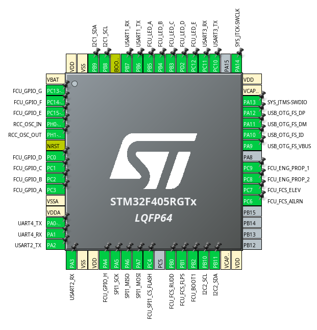

# Flight Control Unit

The Flight Control Unit (FCU) is the central component of the drone's control system, responsible for managing flight operations, and, with sensor data, executing control algorithms to ensure stable and efficient flight. The FCU interfaces with various subsystems, including the Navigation Unit, Motor Controllers, and Communication Modules, to coordinate the drone's movements and respond to pilot commands or autonomous flight plans.

## Communication Protocols

The Flight Control Unit uses the following communication protocols:

- I2C1: Communication with Navigation Unit for receiving navigation data
- I2C2: Communication with auxiliary sensors (e.g., battery monitor, EEPROM, PWM Driver)

- SPI1: Communication with Flash memory for data logging and firmware storage

- UART1: Communication with Navigation Unit for receiving navigation data
- UART2: Logging/Debugging interface for development and troubleshooting
- UART3: Communication with Radio Receiver for pilot commands
- UART4: Communication with additional peripheral (e.g., camera module)

- USB_OTG_FS: Communication with PC for debugging and firmware updates

- SWD: Debugging interface for development and troubleshooting

- TIM1: PWM output for motor control signals
- TIM3: PWM output for flight control surfaces

## Peripheral Integration

The Flight Control Unit integrates with several peripherals to enhance its functionality and ensure reliable operation. Key peripherals include:

- Motor Controllers: Interface with Electronic Speed Controllers (ESCs) to manage motor speeds and ensure stable flight.
- Radio Receiver: Receives pilot commands for manual control of the drone.
- Battery Monitor: Monitors battery voltage and current to ensure safe operation and prevent power loss during flight.
- EEPROM: Stores configuration settings, control parameters, and flight logs for persistent data retention.
- PWM Driver: Manages additional PWM outputs for controlling servos or lights.
- Flash Memory: Provides non-volatile storage for flight data logging and firmware updates.

## EEPROM Usage

The Flight Control Unit utilizes EEPROM for storing critical configuration settings, control parameters, and flight logs. This non-volatile memory ensures that important data is retained even when the power is turned off, allowing the FCU to maintain its settings and operational history across power cycles. The EEPROM is accessed via the I2C2 communication protocol, enabling efficient read and write operations as needed.

## Flash Memory Usage

The Flight Control Unit employs Flash memory for data logging and firmware storage. This allows the FCU to record flight data, such as sensor readings and control inputs, which can be analyzed post-flight for performance evaluation and troubleshooting. Additionally, the Flash memory provides a reliable storage medium for the FCU's firmware, enabling easy updates and ensuring that the latest software is always available for optimal operation. The Flash memory is accessed via the SPI1 communication protocol, facilitating high-speed data transfer for both logging and firmware management.

## Pin Assignment

