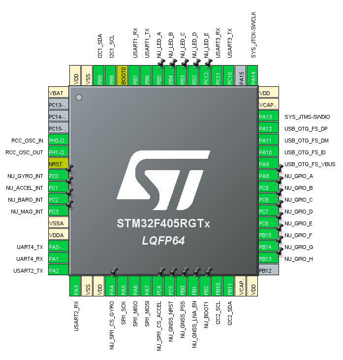

# Navigation Unit

The main objective of the Navigation Unit is to provide accurate and reliable navigation data to the Flight Control Unit (FCU) for the operation of the drone. The Navigation Unit is responsible for processing data from various sensors, including the Inertial Measurement Unit (IMU), Global Navigation Satellite System (GNSS), and other auxiliary sensors, to compute the drone's position, velocity, and orientation. After the sensor gathering, the State Estimation module processes the data applying sensor fusion algorithms to provide accurate navigation information to the FCU. The processed navigation data is then transmitted to the FCU for use in flight control and decision-making.

## Communication Protocols

The Navigation Unit uses the following communication protocols:

- I2C1: Communication with FCU for receiving commands and sending navigation data
- I2C2: Communication with sensors (e.g., barometer, magnetometer)

- SPI1: Communication with IMU sensors for high-speed data transfer

- UART1: Communication with FCU for receiving commands and sending navigation data
- UART2: Logging/Debugging interface for development and troubleshooting
- UART3: Communication with GNSS receiver for position, velocity, and time data
- UART4: Additional UART connector for auxiliary sensors

- USB_OTG_FS: Communication with PC for debugging and firmware updates

- SWD: Debugging interface for development and troubleshooting

## Sensor Integration

The Navigation Unit integrates data from multiple sensors to provide comprehensive navigation information. The primary sensors include:

- Inertial Measurement Unit (IMU): Provides acceleration and angular velocity data for state estimation and control.
- Global Navigation Satellite System (GNSS): Provides position, velocity, and time data for navigation and control.
- Barometer: Provides altitude data for vertical navigation and control.
- Magnetometer: Provides heading information for orientation and control.
- Temperature Sensor: Provides temperature data for sensor calibration and compensation.
- Auxiliary Sensors: Probably will be used for airspeed measurement in the future, providing additional data for navigation and control.
- EEPROM: Stores calibration data, configuration settings, and other non-volatile information.

## EEPROM Usage

The Navigation Unit utilizes EEPROM for storing calibration data, configuration settings, and other non-volatile information. This allows the unit to retain important data even when power is lost, ensuring that the drone can operate effectively without needing to recalibrate or reconfigure after each power cycle. The EEPROM is accessed via the I2C2 communication protocol, allowing for efficient read and write operations as needed.

## Pin Assignment

